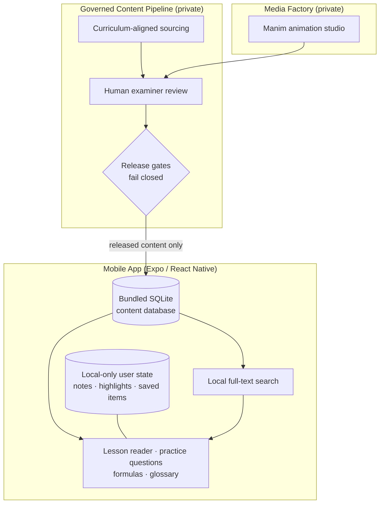

# Prepnest

> Offline-first WASSCE Study OS for Ghana — architecture and design documentation.

Prepnest is an independent product. It is **not affiliated with or endorsed by WAEC**, and it does not distribute official examination material.

---

## What It Is

Prepnest is a mobile study companion for students preparing for the WASSCE in Ghana. The whole product is built around one constraint that matters in this market: **it must work without internet**, on mid-range Android phones, with data costs near zero after install.

Three principles drive the design:

| Principle | What it means in the product |
|---|---|
| **Offline-first** | The study library, search index, and all personal study state live on the device. No account required to study. |
| **Governed content** | Every study item passes through a governed pipeline — sourcing, human examiner review, and release gates that fail closed. Content that hasn't cleared review does not ship. |
| **Honest UX** | The app never fakes availability. If a paper, narration, or answer isn't ready, the interface says so plainly instead of showing empty promises. |

---

## Architecture

**Key choices**

- **Bundled SQLite + local FTS** instead of a cloud search service — search works in airplane mode and costs the student nothing.
- **Local-only user state** — notes, highlights, bookmarks, and progress stay on the phone; backup is explicit and user-initiated.
- **Release gates as code** — content governance checks run in CI-style smoke scripts; an unreviewed item structurally cannot reach a release build.
- **Manim media factory** — math and science visuals are produced in a separate private studio and enter the app only through the same review pipeline.

---

## Stack

| Layer | Technology |
|-------|------------|
| **Mobile** | Expo, React Native, Expo Router |
| **Content store** | Bundled SQLite with full-text search |
| **Content pipeline** | Governed YAML → review → build-time import (private) |
| **Animation** | Manim (private production studio) |
| **Quality** | TypeScript, smoke-script suite pinning copy, layout, and governance behavior |

> Earlier prototypes used a Sanity CMS + hosted-search architecture. That generation is retired; its open-sourced schema is preserved as the archived [sanity-education-starter](https://github.com/iamnortey/sanity-education-starter).

---

## Access

The Prepnest application and content pipeline are in **private repositories** — the product is pre-release and its study corpus is governed. This repository is the public architecture record; deeper technical walkthroughs are available on request.

---

## Related

- [Case study](https://github.com/iamnortey/portfolio/blob/main/case-studies/prepnest.md) — problem, architecture, and engineering decisions
- [Portfolio](https://github.com/iamnortey/portfolio) — all case studies, ADRs, and runbooks
- [Sanity Education Starter](https://github.com/iamnortey/sanity-education-starter) — archived open-source schema from Prepnest's earlier architecture generation
